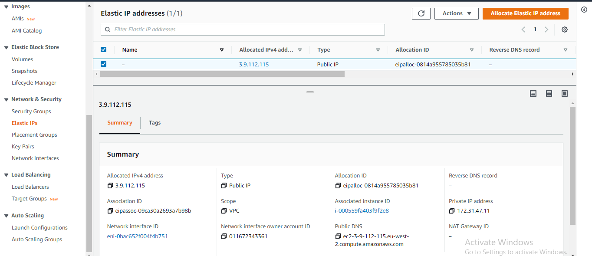

## **Project_10_Load Balancer Solution With Nginx and SSL/TLS**
___
____
### **Step-1 Configure NGINX as A Load Balancer**
___
>#### Launch 1 EC2 instance with Ubuntu 20.04 Operating System and name it NGINX-LB  Open TCP port 80 for HTTP connections, and TCP port 443 – this port is used for secured HTTPS connections)

>#### Update /etc/hosts file 
Access the File using *`sudo vi /etc/hosts`* and update for local DNS with Web Servers’ names (e.g. Web1 and Web2) and their Private IP addresses.

>#### Install and Configure NGINX Load Balancer

##### *Update the instance and Install Nginx:*
* *`sudo apt update`*
* *`sudo apt install nginx`*

##### *Configure Nginx LB using Web Servers’ names defined in /etc/hosts using :*
* *`sudo vi /etc/nginx/nginx.conf`*

##### Restart Nginx and make sure the service is up and running
* *`sudo systemctl restart nginx`*
* *`sudo systemctl status nginx`*

### **Step-2 Register a New Domain Name**
___
Using AWS Route53 i registered a new domain name `www.olusegundevopsproject.click`

>#### Assign & Allocate Elastic IP
On AWS console select Elastic IP and Assign an Elastic IP to your Nginx LB server and associate your domain name with this Elastic IP

>#### Update A record in the Registrar
In the registrar configure A record to point to Nginx LB using Elastic IP address

>#### Configure Nginx to recognize your new domain name
Using the *`sudo vi /etc/nginx/nginx.conf`* command to acces the nginx config file the domain name is modifedto the newly created one fron Route53

>#### Accessing the Web Server
To verify that our configuration done  works I access the Web Server from a browswer using the new Domain name; http://www.olusegundevopsproject.click

### **Step-3 Configure secured connection using SSL/TLS certificates**
____
>#### Install certbot and request for an SSL/TLS certificate
* *`sudo systemctl status snapd`*
* *`sudo snap install --classic certbot`*
* *`sudo ln -s /snap/bin/certbot /usr/bin/certbot`*
* *`Sudo certbot --nginx`*

>#### Accessing the Web Server using https
To verify that our cerbot configuration done  works I access the Web Server from a browswer adding https to the new Domain name; https://www.olusegundevopsproject.click

>#### Set up periodical renewal of your SSL/TLS certificate
* *`sudo certbot renew --dry-run`*
* *`crontab -e`*

