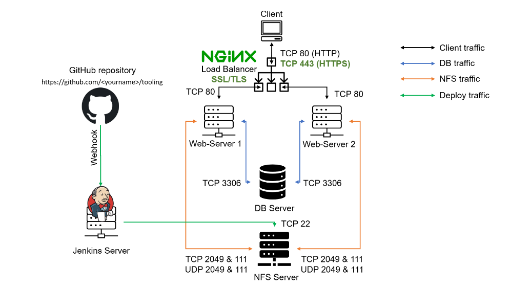

# Project_10_Load-Balancer-Solution-With-NGINX-SSL-TLS
#### In this Project, an alternative to the solution deployed [Project_8_Load-Balancer-Solution-With-Apache](https://github.com/OlusegunMichael/Project_8_Load-Balancer-Solution-With-Apache.git) will be implemented with NGINX Load Balancing Web Solution with secured HTTPS connection with periodically updated SSL/TLS certificates.

In this project I will register a website with LetsEnrcypt Certificate Authority, to automate certificate issuance and use a shell client recommended by LetsEncrypt – cetrbot.

*Implementation will be done using the following components:*
* [x] Prerequisite Project: [**Project 9**](https://github.com/OlusegunMichael/Project_9_Continuous-Integration-Pipeline-for-Tooling-Website.git) 
* [x] Infrastructure: AWS(EC2)
* [x] Ubuntu 20.04
* [x] NGINX: Load Balancer
### *Propsed Archetecture*

